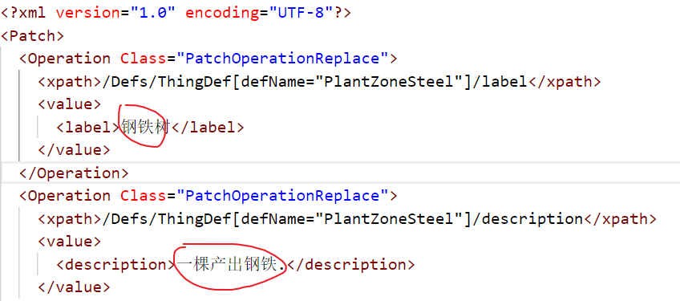

## 编译要求

~~目前是sln格式，所以只能在Windows上编译。Linux理论上也可以，只是要改成CMake格式（不打算支持）。建议使用[vcpkg](https://github.com/microsoft/vcpkg)安装依赖。~~

- CMake 版本≥3.11：为了支持FetchContent

- C++17: 为了支持`std::filesystem`

本身依赖的libxml2和format用FetchContent来获取源码编译了。

## 用法

### Windows

把某个mod的Defs文件夹直接拖到 `RWSimplifiedPatcher.exe`上，就会生成一个`all_patch.xml`文件。

<a id='1'>翻译</a>`<value>`标签内的文本内容即可。也可以直接把一个xml拖到exe上。

>`<value>`标签内可能是`<label>`，也可能是其他东西，总而言之别把改了`<>`之间的内容改了就行（大概会自己翻译mod的也知道xml的结构吧orz）

翻译完`all_patch.xml`，可以：

- 直接把它放到原mod文件夹里的Patch目录下
- 或，自己建一个翻译mod放到`Mods`文件夹，结构参考[example_mod](https://github.com/sieveLau/RWSimplifiedPatcher/tree/master/example_mod)

### Linux和Mac

命令行运行`./RWSimplifiedPatcher <Defs目录>`或者`./RWSimplifiedPatcher <xml文件>`，或者直接`./RWSimplifiedPatcher`再输入路径都可以，就会生成`all_patch.xml`。剩下的参考[上面的翻译步骤](#1)。

## 缘由

当初用[RimTrans](https://github.com/RimWorld-zh/RimTrans)真是省心省力，然而现在它双击的时候只会一声不吭地crash。

看了[全能者之夕的视频](https://www.bilibili.com/video/BV1Hg411u7X1)之后，我用Patch xml的方法翻译了[WallStuff](https://steamcommunity.com/sharedfiles/filedetails/?id=1994340640)的defs。然后我发现这个xml生成过程是可以自动化的……

## 工作原理

用libxml2读取xml文件并检测特定的Defs，例如`ThingDef`，然后生成 [PatchOperationReplace](https://rimworldwiki.com/wiki/Modding_Tutorials/PatchOperations) xml来覆盖`<label>`和`<description>`（游戏内的文本主要就是这个两个）。

其实按照实现的方法来说，直接把某个Mod的文件夹直接提供给这个程序，它也能遍历出所有的xml……但是不太建议，一个是时间长，另一个是可能扫描到不应该被翻译的xml。

## 配置

~~It reads `defclasses.txt` to know what defs should be patched. Modify `defclasses.txt` to suit your requirement. If no `defclasses.txt` is found in the same folder of `RWSimplifiedPatcher.exe`, it will just catch `ThingDef`.~~

不用配置。程序会自动检测所有以"Def"结尾的东西，然后抽取`<label>`和 `<description>`（如果有的话）并生成patch xml。

## Todo

- [ ] 自动读取和成成About.xml
- [ ] ~~[ ] [[notlikely]] GUI~~
